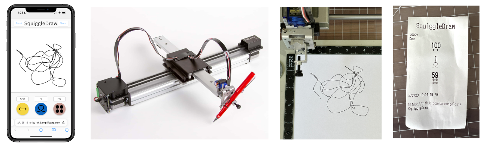
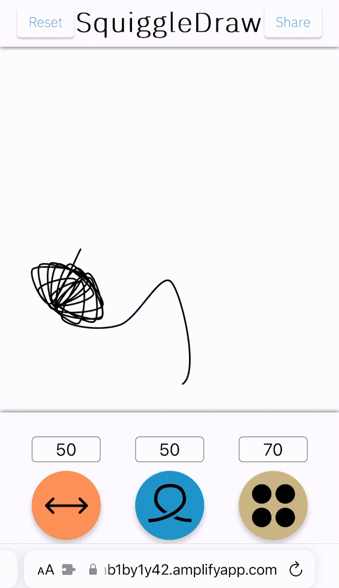

# SquiggleDraw

Contributor: Deanna Gelosi

## Overview

Generate a scribble drawing on your phone and see a robot draw it live! Each drawing produces with a receipt documenting how it was created. SquiggleDraw uses an [AxiDraw](https://www.axidraw.com/) and thermal receipt printer controlled from your phone with a web app. Click the [web app](https://main.d3m6znb1by1y42.amplifyapp.com/?inviteKey=) to get started (invite key required)

**Languages**: Python3, HTML/CSS, Javascript

**Libraries**: Adafruit Thermal Printer library, p5.js, AxiDraw Python API library

**Development Environments**: VS Code, Figma, TablePlus

**Reference**: [Squiggle Generator](https://github.com/deannagelosi/squigglegenerator) Processing (Java) project


<p align = "center">
Fig.1 - A workflow of SquiggleDraw, starting with 1) the movible UI, 2) the AxiDraw CNC plotter, 3) the final drawing, and 4) the receipt documenting squiggle parameters.
</p>

## Features
<p align = "center">

SquiggleDraw is an AWS Amplify app that creates generative scribble drawings based on three parameters:

1. Line length
2. Turn radius: ranges between 1/4 $\pi$ and $\pi$
3. Compression: the space between points that make up a line

The app connects to a AWS Dyanmo DB which stores the parameters and other user defined values (title and author) and sends it to a queue. The queue is hosted on a Raspberry Pi and allows for job selection.

Once a job is chosen, the AxiDraw recreates the scribble on paper and a thermal printer creates a receipt documenting the user selected parameters.


## How to Run

### Mobile UI

Visit the mobile [web app](https://main.d3m6znb1by1y42.amplifyapp.com/?inviteKey=) to load SquiggleDraw (invite key required).

### Raspberry Pi and LCD screen

Start the Raspberry Pi by initiating an ssh connection.

```zsh
python3 rasp_pi/connect_AWS.py
```

Then, run the following command to start the touchscreen UI on the Raspberry Pi.

```zsh
python3 rasp_pi/lcd_controller.py
```

### SSH over VPN

If needed, use Tailscale to SSH over a VPN.

```zsh
# Check tailscale is running
sudo tailscale up

# Find te tailscale ip address:
tailscale ip -4
```

### AxiDraw and Thermal Printer

Connect the AxiDraw to the Raspberry Pi using USB.

Connect the thermal printer to the Raspberry Pi using a serial connection
